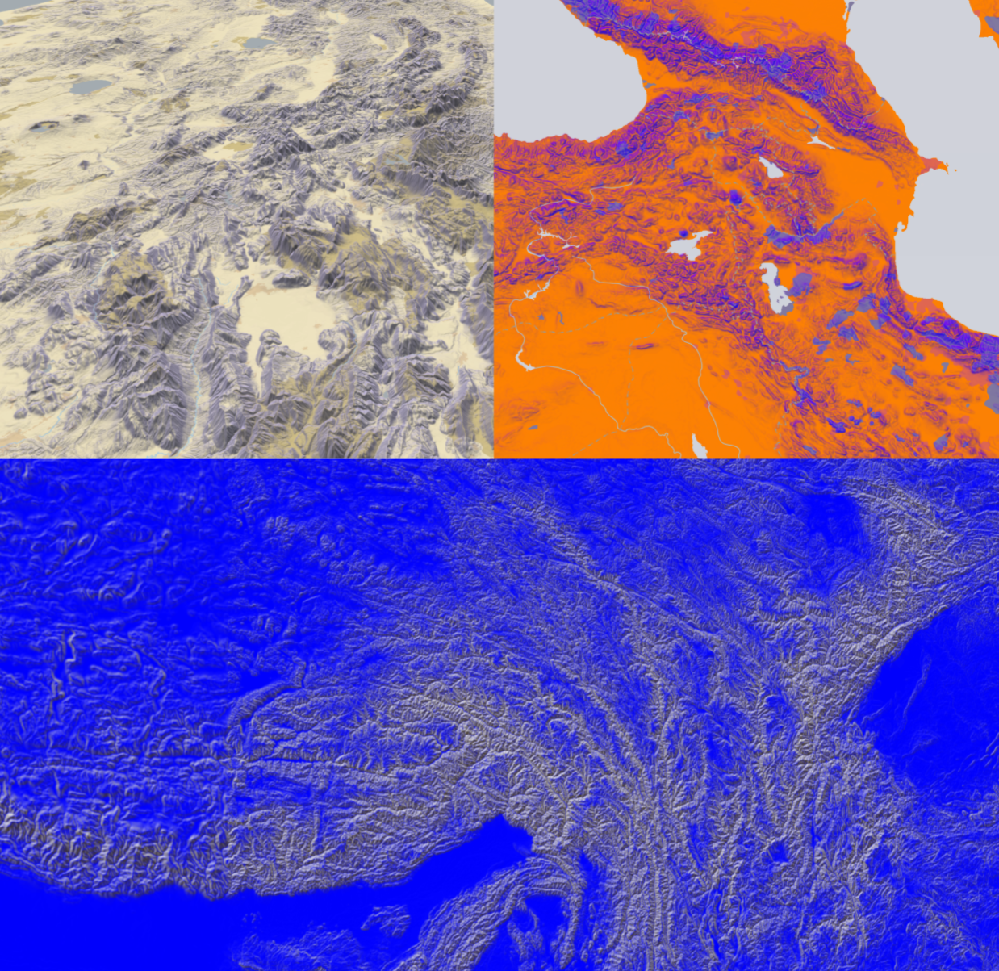

## *Abitare Rurale*

### DotDotDot, Milano

Mappa interattiva basata su **Maplibre GL** come framework di visualizzazione, con **PMTiles** per il serving dei dati - nessuna dipendenza da API esterni.

L'approccio è **vector-first**: i vettori costituiscono la base cartografica, mentre un layer raster viene sovrapposto per il rendering del terreno 3D. È inoltre possibile integrare facilmente elementi 3D custom tramite **Three.js**.

| Componente | Ruolo |
|---|---|
| Maplibre GL | Rendering della mappa (vettoriale + raster) |
| PMTiles | Serving statico dei tile, self-hosted |
| Three.js | Embed di elementi 3D custom |
| Maputnik | Editing visuale dello stile della mappa |

## Editing dello stile

Lo stile della mappa è modificabile in modo visuale tramite Maputnik. Upload il "styles_maputnik/style_dark_black.json" qui:

[Apri in Maputnik](https://maplibre.org/maputnik/?layer=3379389063%7E0#0.46/0/0)

## Dati cartografici (self-hosted)

Per servire i dati localmente senza dipendere da servizi esterni:

- **Mappa 2D** — estratto via MapTiler Cloud
  → [Download 2D extract](https://cloud.maptiler.com/auth/widget?next=https://data.maptiler.com/my-extracts/?bounds=-180,-90,180,90)

- **Mappa 3D (terreno)** — via Mapterhorn
  → [Download 3D data](https://mapterhorn.com/data-access/)
  → [Visualizzatore coverage](https://mapterhorn.com/coverage/#map=3.22/41.2/13.31)
  Consiglio la versione **low-res**: qualità più che sufficiente per il progetto.

## Struttura dati

- **`data/`** contiene il dataset completo: `points.csv` + `points.json`, entrambi con **44.363** punti (coppie lat/lon).
- **`data_reduced/`** è un sottoinsieme filtrato: solo i **432** punti per cui esiste più di un'immagine associata.

  

